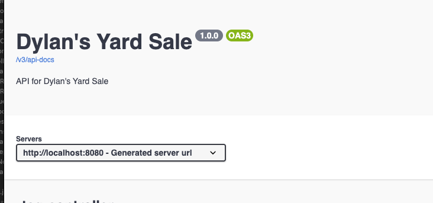
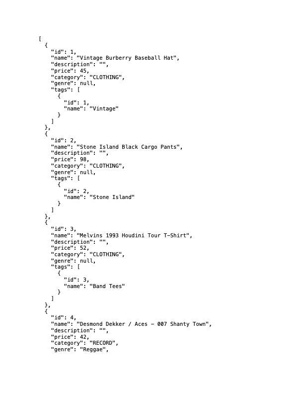
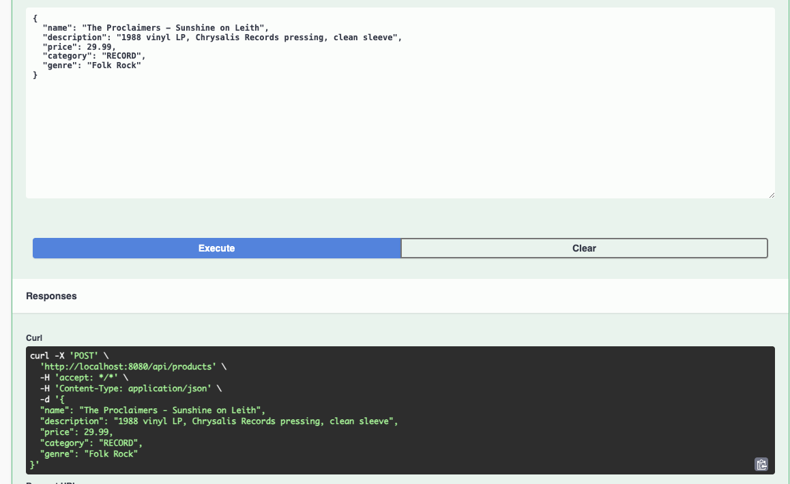
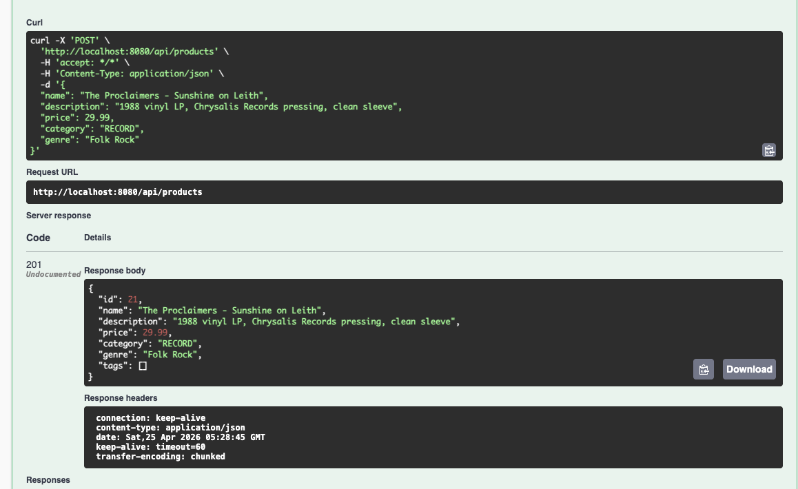
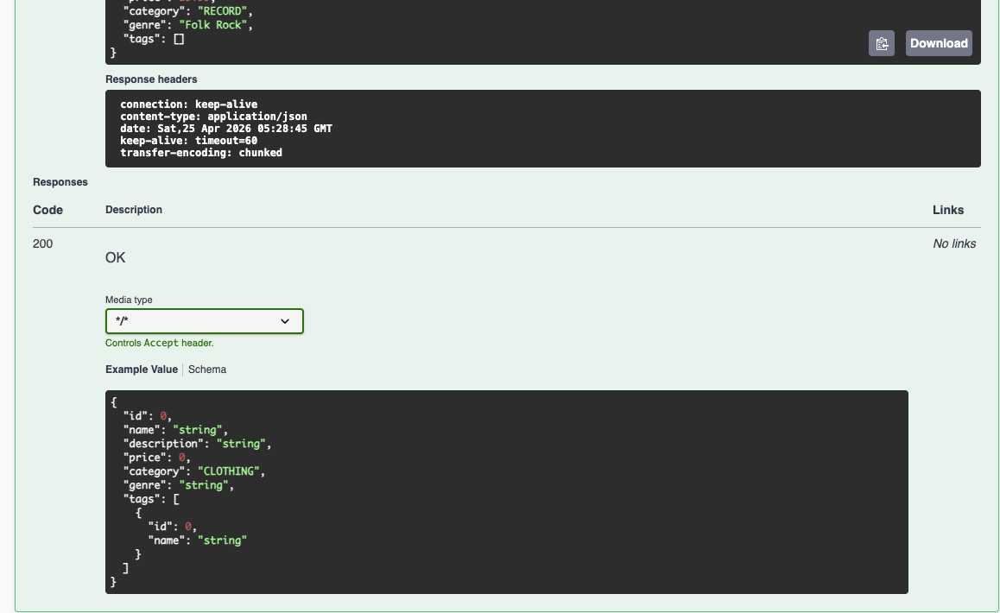
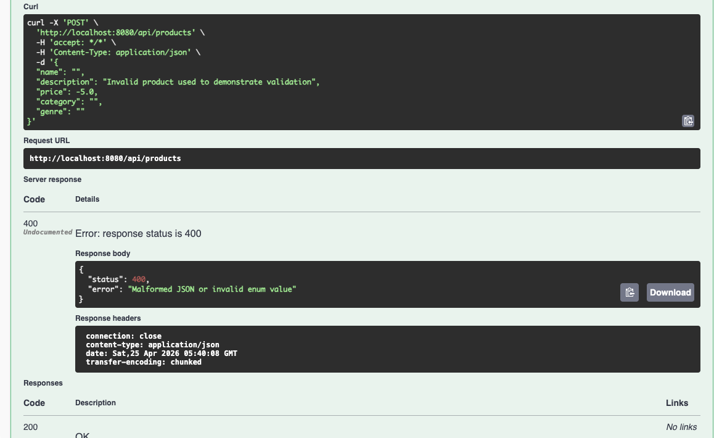

# Dylan's Yard Sale API

Spring Boot + JPA + MySQL REST API for managing products, tags, orders, and order items for a yard-sale style marketplace.

## Final Project Requirements Coverage

### 1) At least 3 entities / 3 tables
Met. This project includes at least 4 core entities and tables:
- `Product` (`products`)
- `Tag` (`tags`)
- `Order` (`orders`)
- `OrderItem` (`order_items`)
- Plus join table: `product_tags` for Product/Tag many-to-many

### 2) Full CRUD operations in the project
Met. Full CRUD endpoints are implemented (examples):
- `Product`: `GET /api/products`, `GET /api/products/{id}`, `POST /api/products`, `PUT /api/products/{id}`, `DELETE /api/products/{id}`
- `Tag`: `GET /api/tags`, `GET /api/tags/{id}`, `POST /api/tags`, `PUT /api/tags/{id}`, `DELETE /api/tags/{id}`
- `Order`: `GET /api/orders`, `GET /api/orders/{id}`, `POST /api/orders`, `PUT /api/orders/{id}`, `DELETE /api/orders/{id}`
- `OrderItem`: `GET /api/orders/{orderId}/items`, `GET /api/orders/{orderId}/items/{itemId}`, `POST /api/orders/{orderId}/items`, `PUT /api/orders/{orderId}/items/{itemId}`, `DELETE /api/orders/{orderId}/items/{itemId}`

### 3) Each entity has at least one CRUD operation
Met. Every entity listed above has API operations, and multiple entities have complete CRUD.

### 4) At least one entity with all 4 CRUD operations
Met. `Product`, `Tag`, `Order`, and `OrderItem` all support Create, Read, Update, and Delete.

### 5) At least one one-to-many relationship
Met.
- `Order` (one) -> `OrderItem` (many)

### 6) At least one many-to-many relationship + CRUD on it
Met.
- `Product` <-> `Tag` through `product_tags`
- Relationship CRUD examples:
  - Add tag to product: `POST /api/products/{id}/tags`
  - View tags on product: `GET /api/products/{id}/tags`
  - Remove tag from product: `DELETE /api/products/{id}/tags/{tagId}`

### 7) REST API tested with Swagger/Postman/ARC
Met. Swagger is configured and used for endpoint testing, with screenshot evidence below.

## Additional Features Added

- OpenAPI metadata configuration (`OpenApiConfig`) for titled Swagger documentation.
- Global exception handling for:
  - validation errors,
  - malformed JSON / invalid enum,
  - not found errors,
  - type mismatch and DB constraint errors.
- Input validation via Jakarta Validation annotations (e.g., required fields, minimum values, non-negative rules).
- Enum-based domain constraints (`ProductCategory`, `OrderStatus`).
- Seed data support (`DataLoader`) and SQL artifacts included in repo (`dylans_yard_sale.sql`, relationship checks, etc.).
- ERD/database documentation included as PDFs.

## How to Run

1. Use Java 21 and Maven Wrapper.
2. Configure MySQL and ensure schema `dylans_yard_sale` exists.
3. Start the app:
   - `./mvnw spring-boot:run`

## Swagger Access (Single Link)

After starting the app, open:

**http://localhost:8080/swagger-ui/index.html**

## Swagger Screenshot Evidence (.png files in this repository)

## Included Project Artifacts

- SQL:
  - `dylans_yard_sale.sql`
  - `check_database.sql`
  - `product_tags_relationship.sql`
- ERD/relationship docs:
  - `eer_diagram.pdf`
  - `One_to_many.pdf`
  - `many_to_many.pdf`
